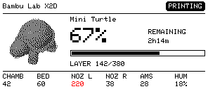

# Bambu Monitor ESP32

An e-paper status display for Bambu Lab printers. Shows print progress, temperatures and a preview of the current plate over your local network.

## Hardware

[LILYGO T5 4.7" E-paper V2.3 ESP32-S3](https://www.aliexpress.com/item/1005004647326743.html)

A microSD card is optional. If one is inserted, the display writes a log to `log.txt` and caches the current plate preview so it reappears straight away after a restart.

## Supported printers

Tested on the Bambu Lab X2D. Other Bambu printers with LAN mode should work too; readings a printer doesn't have (a second nozzle, chamber sensor or AMS) are simply left off the screen.

## Printer requirements

- **LAN mode** enabled, with the printer on the same network as the display.
- **Developer mode** enabled (needed on recent firmware for local MQTT and FTP access).
- The printer's IP address and access code, found on the printer under Settings > Network.

### Plate preview

The WeAct preview first tries configured mappings, filename matches, and the
printer task-ID cache path. If those fail, it scans `3D/3dmodel.model` inside
stored 3MF archives for an exact `ProfileTitle` or `Title` matching the reported
job name. This handles MakerWorld profile names that differ from filenames.
XML text entities and surrounding whitespace are handled. Duplicate metadata
title matches are rejected instead of selecting an arbitrary archive. The
active plate still selects the thumbnail.

The metadata scan uses batches of eight filenames, services MQTT between
transfers, and limits both compressed and expanded metadata to 24 KiB. Large
metadata or unsupported archives are skipped. A first scan can take several
minutes on a printer with many files; incomplete range reads get one retry on
a fresh FTP session, and unsuccessful thumbnail attempts are retried later.
The last completed job can finish loading its preview too. Confirmed exceptions
can still be added to `Bambu_Monitor_ESP32/thumbnail_sources.h`.

Host parser checks: `c++ -std=c++11 tools/tests/thumbnail_identity.cpp -o /tmp/thumbnail_identity && /tmp/thumbnail_identity`.

The preview is read from a 3MF archive accessible on the printer's local storage over FTPS. Availability depends on whether that job's archive is stored there; a cloud or LAN submission by itself does not establish availability. Telemetry can work even when no local archive is available.

## Setup

1. Copy `Bambu_Monitor_ESP32/credentials.example.h` to `credentials.h` and fill in your WiFi, printer IP, access code and serial.
2. In the Arduino IDE, install the **esp32** board package **version 2.0.15** (the LilyGo-EPD47 library doesn't support 3.x).
3. Install libraries:
   - From GitHub (download the ZIP, then **Sketch > Include Library > Add .ZIP Library**):
     - [LilyGo-EPD47, `esp32s3` branch](https://github.com/Xinyuan-LilyGO/LilyGo-EPD47/tree/esp32s3)
     - [pngle](https://github.com/kikuchan/pngle)
   - From the Library Manager: PubSubClient 2.8, ArduinoJson 7.4.3.
4. Open `Bambu_Monitor_ESP32/Bambu_Monitor_ESP32.ino`, select **ESP32S3 Dev Module** with **PSRAM: OPI PSRAM**, **Flash Size: 16MB** and **Partition: 16M Flash (3MB APP/9.9MB FATFS)**, then upload.

## Tools

Optional helper scripts in `tools/`:

- `printer_state.py` connects to the printer (using `credentials.h`), saves its full status to `tools/bambu_dump.json` and prints a readable summary. Handy for checking what your printer reports. Needs `pip install paho-mqtt`.
- `preview/render.py` renders every screen layout to PNGs in `tools/preview/out`, so you can tweak the design without flashing the board. Needs g++, Pillow, numpy and the LilyGo-EPD47 library (set `EPD47_LIB` to its `src` folder if it isn't in `~/Documents/Arduino/libraries`).
- `make_fonts.py` regenerates the `font_*.h` headers from the Inter fonts in `tools/fonts`. Needs `pip install freetype-py`.

## Screens

## Credits

The Mini Turtle shown in the screenshots and preview is [Mini Turtle on MakerWorld](https://makerworld.com/en/models/2670421-mini-turtle#profileId-2955615).

## Licence

[PolyForm Noncommercial 1.0.0](PolyForm%20NonCommercial%201.0.0.txt): free to use, modify and share for any non-commercial purpose. The Inter fonts in `tools/fonts` (and the `font_*.h` headers generated from them) are under the [SIL Open Font License](tools/fonts/Inter-LICENSE.txt).

## Disclaimer

This is an independent hobby project and is not affiliated with, endorsed by or supported by Bambu Lab or Bambu Studio. "Bambu Lab" and printer model names are trademarks of their respective owners.

The software is provided as is, without warranty of any kind. Use it at your own risk; the author accepts no liability for any damage to your printer, prints or other equipment.

## Support

This is a hobby project shared for free. If it's been handy and you'd like to say thanks, a coffee is always appreciated.

## WeAct 2.9-inch BWR / ESP32-WROOM

The original LilyGo profile remains the default. In
`Bambu_Monitor_ESP32/hardware_config.h`, change the default `MONITOR_DISPLAY`
to `DISPLAY_WEACT` (or compile with `-DMONITOR_DISPLAY=2`). Use the WeAct-recommended
**GxEPD2_290_C90c** driver with a 296×128 landscape layout.

Install esp32 **2.0.15**, **GxEPD2 1.6.9** (including Adafruit GFX/BusIO),
**PubSubClient 2.8**, **ArduinoJson 7.4.3**, and **pngle**. LilyGo-EPD47 is not
needed for this profile. Select **ESP32 Dev Module**, **PSRAM: Disabled**,
**Flash Size: 4MB**, and **Partition Scheme: Huge APP (3MB No OTA/1MB SPIFFS)**
for a standard 4MB ESP32-WROOM DevKit. Copy and fill in `credentials.h` as above.

| Panel pin | ESP32 connection |
| --- | --- |
| BUSY | GPIO 4 |
| CS | GPIO 5 |
| RST | GPIO 16 |
| DC | GPIO 17 |
| SCK | GPIO 18 |
| MOSI / DIN | GPIO 23 |
| VCC | 3.3V |
| GND | GND |

The screen reserves **88×76 pixels** for a cropped, monochrome model preview.
Progress, remaining time, job name, and layers sit beside it; six compact sensor
columns sit below. Temperatures are Celsius; `L1`–`L5` indicate AMS humidity
levels when a percentage is unavailable. Missing readings show `--`.
Full refreshes happen at most once per minute, only when the status signature
changes. Full refreshes take several seconds;
MQTT is serviced while the panel is busy. Boot details go to the serial log.

### Preview limits on WROOM

Preview loading prefers the current plate's `_small.png` and preserves heap
headroom for networking. Compressed and uncompressed ZIP members are each
limited to 24 KiB, the central directory to 32 KiB, the ZIP tail search to 4 KiB,
and PNG dimensions to 1024×1024. Two decoding passes crop and sample directly
into a fixed 88×76 grayscale buffer, then dither into an 836-byte bitmap.
The original full-resolution image is never allocated on WROOM.

The WeAct profile also checks embedded archive titles when filename lookup
fails. Unavailable, oversized, unsupported, ambiguous, or unmatched images
show the Bambu logo; telemetry continues. Cloud jobs may have no local
image. A new job invalidates the previous preview. The last completed job's
image remains until the job changes. WeAct uses serial logging and no SD cache.
Actual FTP/TLS memory availability and panel behavior still require hardware
validation; successful compilation does not establish runtime compatibility.

### Desktop preview and fallback logo

Run `python3 tools/preview/render_weact.py` with Pillow, gcc/g++, Adafruit GFX,
and pngle installed. Set `ADAFRUIT_GFX_LIB` to the GFX library root and `PNGLE_LIB`
to pngle's `src` directory if necessary. The harness uses the firmware renderer
and decoder, checks invalid/truncated images, and writes scenarios to
`tools/preview/out/weact/`.

When no live model preview is available, the WeAct display shows the Bambu Lab
logo mark from [Bambu Studio](https://github.com/bambulab/BambuStudio/blob/master/resources/images/splash_logo.svg).
A successfully loaded model preview automatically replaces the logo.

### WeAct thumbnail rendering settings

Edit the compile-time constants in `WeactPreviewStyle` near the top of
`Bambu_Monitor_ESP32/preview_weact.h`, then rebuild/upload:

| Setting | Default | Effect |
| --- | --- | --- |
| `GAMMA` | `2.2f` | Values above 1 brighten midtones; 1 is neutral. |
| `CONTRAST` | `0.90f` | 1 is neutral; lower softens shadows, higher strengthens contrast. |
| `SHARPEN_PERCENT` | `25` | Mild edge enhancement; 0 disables, maximum 100. |
| `BLACK_THRESHOLD` | `120` | Lower favors white; higher favors black (1–254). |
| `DITHER` | `PreviewDither::FloydSteinberg` | Also supports `PreviewDither::Atkinson`. |

The 88×76 pipeline crops/resizes with the bounded two-pass decoder, adjusts
levels/gamma/contrast, mildly sharpens, and dithers to a 1-bit black/white bitmap.
Lifted shadow levels reduce solid-black areas. White margins remain white.
Threshold changes have a stronger effect in Atkinson; Floyd–Steinberg's error
feedback tends to preserve average tone, so use gamma for overall brightness.
Three small grayscale rows and three error rows avoid allocating a second full
image. The thumbnail uses no red channel.

The desktop preview writes `dither_floyd_steinberg.png` and
`dither_atkinson.png` using the actual firmware renderer.
