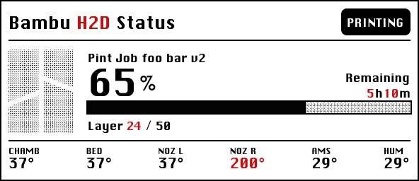

# Bambu Monitor — WeAct BWR / ESP32

A local-network status display for a Bambu Lab H2D, using an ESP32-WROOM and a
**2.9-inch 296×128 black/white/red WeAct e-paper panel**. This repository builds
on [Alloyd21/Bambu_Monitor](https://github.com/Alloyd21/Bambu_Monitor) and retains
the original LilyGo display profile.



Example display layout with sample print data and the Bambu logo fallback.
Run the desktop renderer below for previews from the current firmware.

## Current display

- Chicago typography, with bitmap text for the job name.
- Print percentage, remaining time, and layer count; current layer number in red.
- Solid progress fill over a retro 25% black-dot background.
- Chamber, bed, left/right nozzle, AMS temperature, and AMS humidity readings.
- Celsius degree symbols; bold sensor values with a regular-weight humidity `%`.
- Red nozzle values at 180°C and above; missing values show `--`.
- An 88×76 black-and-white model preview, with a Bambu logo fallback.

The panel is rotated 180° from the original landscape orientation for the
current housing (`setRotation(3)` in the sketch). Refreshes are rate-limited to
at least 60 seconds after the previous refresh completes, and only redraw when
visible information changes. A full refresh has taken about 18.5 seconds on
this setup. MQTT is serviced while the panel is busy.

## Hardware and setup

The current WeAct setup has been used with an H2D. The original upstream project
reports testing its LilyGo profile with an X2D. Other printers and firmware
versions may report different sensors or expose different local-access options.

| WeAct panel pin | ESP32 connection |
| --- | --- |
| BUSY | GPIO 4 |
| CS | GPIO 5 |
| RST | GPIO 16 |
| DC | GPIO 17 |
| SCK | GPIO 18 |
| MOSI / DIN | GPIO 23 |
| VCC | 3.3V |
| GND | GND |

1. Install Arduino ESP32 core **2.0.15**.
2. Install **GxEPD2 1.6.9**, Adafruit GFX/BusIO, **PubSubClient 2.8**,
   **ArduinoJson 7.4.3**, and [pngle](https://github.com/kikuchan/pngle).
3. Copy `Bambu_Monitor_ESP32/credentials.example.h` to
   `Bambu_Monitor_ESP32/credentials.h` and enter your Wi-Fi credentials, printer
   IP, access code, and serial. Keep the printer and display on the same local
   network; enable the local MQTT/FTPS access options required by your printer
   firmware, including developer mode where applicable.
4. Select the WeAct profile in `hardware_config.h` using `DISPLAY_WEACT`, or pass
   `-DMONITOR_DISPLAY=2` when compiling. **The source default is still LilyGo.**
5. Select **ESP32 Dev Module**, **PSRAM disabled**, **4MB flash**, and
   **Huge APP (3MB No OTA/1MB SPIFFS)** for the current ESP32-WROOM board.
6. Build and upload `Bambu_Monitor_ESP32/Bambu_Monitor_ESP32.ino`.

This BWR panel uses the **GxEPD2_290_C90c** driver. LilyGo-EPD47 is not required
for the WeAct build.

### Arduino CLI

With `arduino-cli` on your PATH and the dependencies above installed:

```sh
arduino-cli compile \
  --fqbn esp32:esp32:esp32:PartitionScheme=huge_app \
  --build-property compiler.cpp.extra_flags=-DMONITOR_DISPLAY=2 \
  --build-path .arduino/build-weact Bambu_Monitor_ESP32

arduino-cli board list

arduino-cli upload \
  --fqbn esp32:esp32:esp32:PartitionScheme=huge_app \
  --upload-property upload.speed=115200 \
  --port /dev/cu.usbserial-0001 \
  --input-dir .arduino/build-weact Bambu_Monitor_ESP32
```

Replace the port with your board's port. If using an isolated CLI installation,
pass `--config-file /path/to/arduino-cli.yaml` to each command. The local
`.arduino/` toolchain and `.vscode/` tasks are ignored by Git and are not shipped
with the repository. Serial logging uses **115200 baud**.

## Model preview matching

The WeAct firmware tries confirmed mappings in `thumbnail_sources.h`, matching
archive filenames, and the task-ID cache path. If these fail, it scans stored
3MF archives for an exact embedded `ProfileTitle` or `Title` matching the
printer-reported job name. This handles MakerWorld profiles whose names differ
from the downloaded filename. Duplicate metadata-title matches are rejected
rather than choosing an arbitrary file. The active plate determines which
thumbnail member is requested.

The archive must be accessible through the printer's local FTPS storage. A
cloud or LAN submission alone does not establish whether the file is available.
Correct telemetry does not guarantee that a preview can be retrieved. Avoid
assuming the newest stored file is the active print.

A scan can take several minutes with many stored files. It uses batches of eight
filenames and services MQTT between transfers. Incomplete range reads get one
retry with a fresh FTP session; failed thumbnail attempts retry later. The last
completed job can finish loading its image. A job change invalidates the old
preview. Unavailable or ambiguous previews show the Bambu logo.

On the PSRAM-free WeAct profile:

- Compressed and expanded image/metadata members are limited to 24 KiB each.
- ZIP central directories are limited to 32 KiB; the tail search reads up to 4 KiB.
- PNG dimensions are limited to 1024×1024; the current plate's small PNG is preferred.
- Two decoder passes crop and sample into an 88×76 grayscale buffer, then produce
  an 836-byte bitmap. No full-resolution source PNG buffer is allocated.
- The large PNG decoder allocation is made before the small sampling context.
- Serial logging is used; there is no SD thumbnail cache on WeAct.

## Appearance controls

Edit `WeactStyle` near the top of `Bambu_Monitor_ESP32/screen_weact.h` for text
fonts, colors, and sensor boldness. Placement is in `drawWeactScreen` in the same
file. The layer line uses standard-case **Layer** in 7-point Chicago.

Thumbnail controls live in `WeactPreviewStyle` near the top of
`Bambu_Monitor_ESP32/preview_weact.h`:

| Setting | Current value | Effect |
| --- | --- | --- |
| `THUMB_BRIGHTNESS` | `6` | Signed grayscale offset immediately before dithering; positive lightens, negative darkens. |
| `THUMB_HIGHLIGHT_CUTOFF` | `248` | Post-brightness values above this become white; 255 disables the cutoff. |
| `GAMMA` | `2.2f` | Above 1 brightens midtones. |
| `CONTRAST` | `0.90f` | 1 is neutral; lower softens contrast. |
| `SHARPEN_PERCENT` | `25` | Mild sharpening; 0 disables. |
| `BLACK_THRESHOLD` | `120` | Lower favors white, higher favors black. |
| `DITHER` | `PreviewDither::FloydSteinberg` | Alternative: `PreviewDither::Atkinson`. |

For small brightness adjustments, change only `THUMB_BRIGHTNESS` (for example
6, 12, 18, or 24). Grayscale is **0=black, 255=white**. A brightness value of 0
leaves the grayscale values unchanged at the offset step; the independently
configured highlight cutoff still applies afterward. Dithering and all other
settings remain untouched. Thumbnails never use the red channel.

All settings are compile-time: rebuild and upload after editing. After reboot,
allow time for reconnection, thumbnail retrieval, and the next panel refresh.

### Fonts

Generated Chicago font headers are included. To regenerate them, install Pillow
and supply your locally installed Chicago TTF:

```sh
python3 tools/make_weact_font.py --chicago "/path/to/Chicago v0.5.5.ttf"
```

The Chicago source font is not bundled. Without `--chicago`, this script generates
FreeSans variants from the font in `tools/fonts/`. The LilyGo font generator is
`tools/make_fonts.py` and requires `freetype-py`.

## Desktop validation

The host harness exercises the real WeAct renderer and PNG decoder, including
invalid/truncated input, tone behavior, both dither modes, and black/white-only
thumbnail output. It needs Pillow, gcc/g++, Adafruit GFX, and pngle:

```sh
ADAFRUIT_GFX_LIB=/path/to/Adafruit_GFX_Library \
PNGLE_LIB=/path/to/pngle/src \
python3 tools/preview/render_weact.py

c++ -std=c++11 tools/tests/thumbnail_identity.cpp -o /tmp/thumbnail_identity
/tmp/thumbnail_identity
```

Preview scenarios and dither comparisons are written to `tools/preview/out/weact/`
(ignored by Git). Desktop checks do not establish physical panel appearance or
network reliability. Check those on the device after uploading.

`tools/printer_state.py` queries a real printer using local credentials and
requires `paho-mqtt`. Its printer dump is ignored by Git. Never commit access
codes, Wi-Fi passwords, printer dumps, or generated build output.

## Original LilyGo profile

The original display is a **LILYGO T5 4.7-inch E-paper V2.3 ESP32-S3**. Use
`DISPLAY_LILYGO`, install [LilyGo-EPD47's esp32s3 branch](https://github.com/Xinyuan-LilyGO/LilyGo-EPD47/tree/esp32s3),
and select **ESP32S3 Dev Module**, **OPI PSRAM**, **16MB flash**, and
**3MB APP/9.9MB FATFS** partitions with ESP32 core 2.0.15. Its optional microSD
card supports logging and thumbnail caching. `tools/preview/render.py` provides
the LilyGo desktop preview and additionally needs numpy and LilyGo-EPD47.

## Credits and licence

Original project by Adam Lloyd: [Alloyd21/Bambu_Monitor](https://github.com/Alloyd21/Bambu_Monitor).
The Mini Turtle used by the desktop preview is from
[MakerWorld](https://makerworld.com/en/models/2670421-mini-turtle#profileId-2955615).
The fallback logo comes from
[Bambu Studio](https://github.com/bambulab/BambuStudio/blob/master/resources/images/splash_logo.svg).

The project retains its [PolyForm Noncommercial 1.0.0 licence](PolyForm%20NonCommercial%201.0.0.txt).
Inter font licensing is in [tools/fonts/Inter-LICENSE.txt](tools/fonts/Inter-LICENSE.txt);
FreeFont licensing is in [tools/fonts/FreeFont-LICENSE.txt](tools/fonts/FreeFont-LICENSE.txt).
Chicago is supplied separately by the user; this project does not grant rights
to that font.

This is an independent hobby project, not affiliated with or endorsed by Bambu
Lab. Software is provided as-is, without warranty; see the licence for terms.
